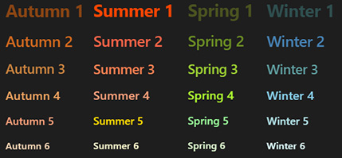
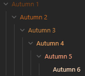

# 🪨 Obsidian Seasonal Header Palette

This project provides a seasonal color palette for Obsidian headers (H), with themes for autumn, summer, spring, and winter.

**Headers Preview**

**Outline Preview**

## 🌈 Features
Each seasonal palette is designed to bring a unique ambiance to your notes:

- **Autumn**: Warm and earthy tones to enhance focus and comfort.
- **Summer**: Bright and vibrant colors for an energized workspace.
- **Spring**: Fresh and pastel hues for a calm and clear environment.
- **Winter**: Cool and crisp shades to keep things minimal and focused.

## 🛠️ How to Use

1. Copy the desired CSS files (`obsidian-seasonal-header-palette.css`, `obsidian-autumn.css`, `obsidian-summer.css`, `obsidian-spring.css`, `obsidian-winter.css`) into your Obsidian vault’s `snippets` folder.
2. Enable the snippet(s) in Obsidian by going to **Options > Appearance > CSS snippets**.
   - **Main file**: `obsidian-seasonal-header-palette.css` includes all seasons in one file, allowing you to switch palettes by using class names in note properties.
   - **Individual seasonal files**: Each season file (`obsidian-autumn.css`, `obsidian-summer.css`, etc.) provides a standalone color scheme for that season.
3. To switch between seasonal themes for individual notes:
   - If using the main file, add `cssclasses` with the season class name (`autumn-palette`, `summer-palette`, `spring-palette`, `winter-palette`) in note properties.
   - If using individual season files, simply enable or disable the corresponding snippet as needed.

For detailed usage instructions, see the comments in each CSS file.

## 🤝 Contribution Guidelines
I’d love your help in making the Obsidian Seasonal Header Palette even better! Here are a few ways you can contribute:

1. **Report Issues**: Found a bug or have a suggestion? Open an issue on GitHub to let us know!
2. **Suggest New Features**: Have ideas for additional seasonal palettes or unique color schemes? We’d love to hear them. Just create a GitHub issue to start the conversation.
3. **Create Pull Requests**: If you’re familiar with CSS and want to make direct contributions, feel free to fork the repository, make your changes, and submit a pull request. We’ll review it as soon as possible!

All contributions are welcome, whether it’s a small tweak or a whole new feature!

## 🐞 Known Issues
There are currently no known issues. If you encounter any bugs or display issues, please let us know by opening an issue on GitHub. Your feedback helps us keep this project running smoothly for everyone!

## 🪪 Contact

..::::.. Marko Zakrajsek ..::::.. marko@zakrajsek.org ..::::.. [zakrajsek.org](https://zakrajsek.org/) ..::::..

## 📜 License

This project is licensed under the MIT License.

## ☕️ Fuel My Coding Obsession

If you’re enjoying this code (or it saved you from a major headache), why not buy me a coffee? Warning: there’s a strong chance it’ll turn into late-night coding fuel! Just click the button below to contribute to the caffeine-fueled madness that keeps this project going. Thanks a latte! ☕️

