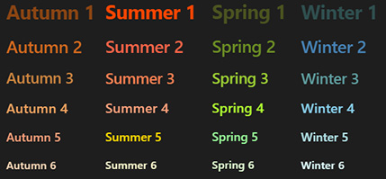
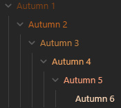

# Obsidian Seasonal Header Palette

This CSS file provides a seasonal color palette for Obsidian headers (H), featuring autumn, summer, spring, and winter themes.

**Headers**

**Outline**

## How to Use
1. Copy the `obsidian-seasonal-header-palette.css` file into your Obsidian vault’s `snippets` folder.
2. Enable the snippet in Obsidian by going to **Options > Appearance > CSS snippets**.
3. The default palette will be applied automatically. To use a specific seasonal palette (Autumn, Summer, Spring, Winter) for individual notes, add the appropriate class name (`autumn-palette`, `summer-palette`, `spring-palette`, `winter-palette`) to the note properties.

For detailed usage instructions, see the comments in the CSS file.

## License
This project is licensed under the MIT License.
